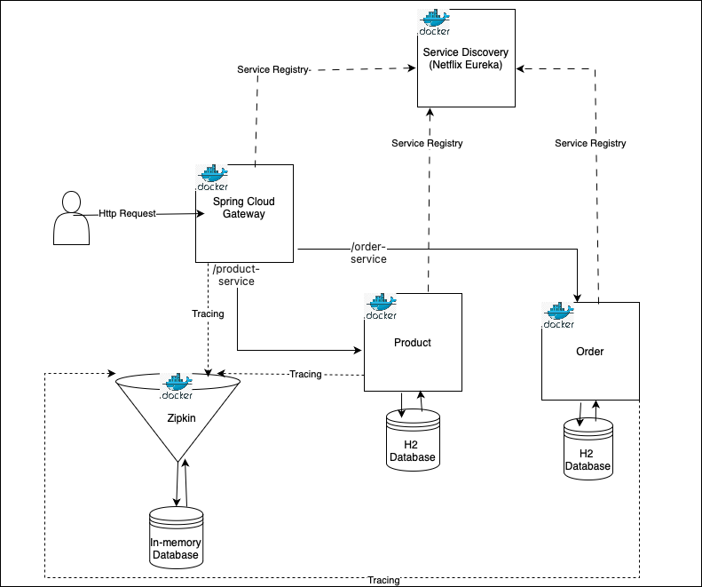

E-Commerce System 

Overview 

This project demonstrates a microservice architecture built with a focus on scalability, reliability, and resilience. By leveraging distributed systems principles, it showcases how multiple services can communicate synchronously to ensure seamless interactions and one service communicates asynchronously to enhance scalability and responsiveness.

The architecture is designed to handle growing demands while maintaining fault tolerance, ensuring the system remains operational even during partial failures. It serves as an example of building a robust, maintainable, and scalable system that adapts to real-world challenges in distributed environments

                    Architectural Diagram(The diagram will be getting updates)

                            Key components
Service Design:

    Product Service: Responsible for posting and retrieving product details, ensuring modular separation.
    
    Order Service: Manages product ordering, enabling a structured and maintainable service layer.
    
    API Gateway: Serves as the central entry point for all requests, facilitating intelligent request routing and load balancing via Eureka. It also helps in enforcing security measures and cross-cutting concerns like correlation IDs.
    
Communication:

    The services communicate in a stateless manner, using both REST and event-based messaging.
    
    Asynchronous Communication: Utilized for long-running processes, with Kafka as the message broker and Redis for caching, reducing database load.
    
    Synchronous Communication: Used for critical and frequently accessed data to ensure consistency and reduced latency.

Infrastructure:

    Database: The project uses an in-memory database for simplicity, given its personal nature. However, production-ready alternatives like MySQL or PostgreSQL can be used.
    
    Message Broker: Kafka is employed to handle event-driven communication efficiently.
    
    Monitoring & Logging: Zipkin and Spring Metrics are integrated to observe and trace API calls.
    
    Service Discovery: Eureka enables dynamic service registration, intelligent routing, and horizontal scaling.
    
    Security: Plans to implement authentication using OAuth2 and Keycloak.

Installation

Prerequisites

Docker & Docker Compose: Used for portability, ensuring all dependencies are contained within lightweight containers.

Future Consideration: Kubernetes may be explored for enhanced orchestration.

Steps to Run

Clone the repository or just download the docker-compose file.

Ensure Docker is installed.

Run docker-compose up to start all services.

Access the API Gateway to interact with the help of postman.

