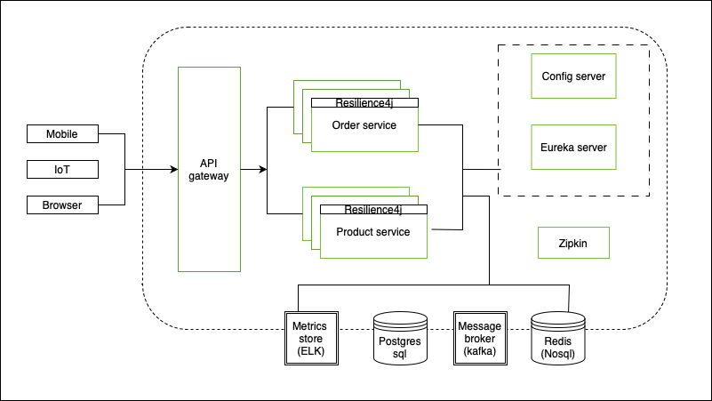
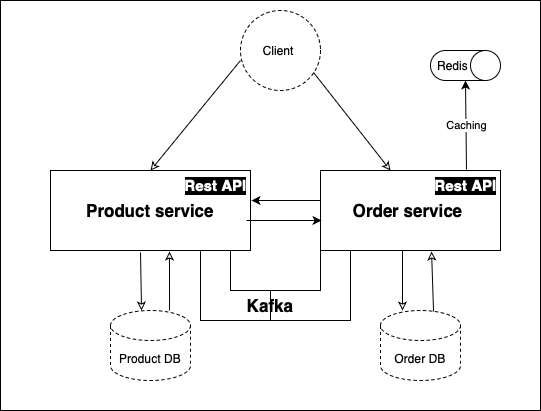

# E-Commerce System 

# Overview 

This project demonstrates a microservice architecture built with a focus on scalability, reliability, and resilience. By leveraging distributed systems principles, it showcases how multiple services can communicate synchronously to ensure seamless interactions and one service communicates asynchronously to enhance scalability and responsiveness.

The architecture is designed to handle growing demands while maintaining fault tolerance, ensuring the system remains operational even during partial failures. It serves as an example of building a robust, maintainable, and scalable system that adapts to real-world challenges in distributed environments

# Architectural Diagram

                            
                Key components
The E-commerce system is decomposed into two core components. All of them are independently deployed applications
organized around based on there functionality.

Notes

* Each microservice has its own database, so there is no way to bypass API and access persistence data directly.
* H2 database(in-memory) is used as a primary database for each of the services.
* All services are talking to each other via the Rest API(Synchronous) or a kafka message stream (asynchronous) 

# Infrastructure

Spring cloud provides powerful tools for developers to quickly implement common distributed systems patterns

### API Gateway

API Gateway is a single entry point into the system, used to handle requests and routing them to the appropriate backend service. Also, it can be used for authentication, insights, stress and canary testing, service migration, static response handling and active traffic management.

### Service Discovery

Service Discovery allows automatic detection of the network locations for all registered services. These locations might have dynamically assigned addresses due to auto-scaling, failures or upgrades.

The key part of Service discovery is the Registry. In this project, we use Netflix Eureka. Eureka is a good example of the client-side discovery pattern, where client is responsible for looking up the locations of available service instances and client-side load balancing between them.

With Spring Boot, you can easily build Eureka Registry using the spring-cloud-starter-eureka-server dependency, @EnableEurekaServer annotation and simple configuration properties. This service will be registered with the Eureka Server and provided with metadata such as host, port, health indicator URL, home page etc. Eureka receives heartbeat messages from each instance belonging to the service. If the heartbeat fails over a configurable timetable, the instance will be removed from the registry.

Also, Eureka provides a simple interface where you can track running services and a number of available instances.

### Spring Load balancer, Circuit breaker and Http client

#### Spring Load balancer

Spring Load balancer is a client side load balancer which gives you a lot of control over the behaviour of HTTP and TCP clients. Compared to a traditional load balancer, there is no need in additional network hop - you can contact desired service directly.

Out of the box, it natively integrates with Spring Cloud and Service Discovery. Eureka Client provides a dynamic list of available servers so Spring Load balancer could balance between them.

#### Resilience4j

Resilience4j is the implementation of Resilience Pattern, which gives us a control over latency and network failures while communicating with other services. The main idea is to stop cascading failures in the distributed environment - that helps to fail fast and recover as soon as possible - important aspects of a fault-tolerant system that can self-heal.

Moreover, Spring metric generates metrics on execution outcomes and latency for each command, that we can use to monitor system's behavior.

#### Feign

Feign is a declarative Http client which seamlessly integrates with Ribbon and Hystrix. Actually, a single spring-cloud-starter-feign dependency and @EnableFeignClients annotation gives us a full set of tools, including Load balancer, Circuit Breaker and Http client with reasonable default configuration.

#### Log analysis

Centralized logging can be very useful while attempting to identify problems in a distributed environment. Elasticsearch, Logstash and Kibana stack lets you search and analyze your logs, utilization and network activity data with ease.

#### Distributed tracing

Analyzing problems in distributed systems can be difficult, especially trying to trace requests that propagate from one microservice to another.

Zipkin solves this problem by providing support for the distributed tracing. It adds two types of IDs: traceId and spanId. spanId represents a basic unit of work, for example sending an HTTP request. The traceId contains a set of spans forming a tree-like structure. For example, with a distributed big-data store, a trace might be formed by a PUT request. Using traceId and spanId for each operation we know when and where our application is as it processes a request, making reading logs much easier.

### Let's try it out

Before you start Install Docker and Docker Compose.

#### Currently Working on: Kubernetes is currently being explored for enhanced orchestration.

Steps to Run

Clone the repository or just download the docker-compose file.

Ensure Docker is installed.

Run docker-compose up to start all services.

Important endpoints

* http://localhost:8080 - Gateway (Gateway for all services)
* http://localhost:8761 - Eureka Dashboard(Service Discovery)
* http://zipkin:9411/api/v2/spans - zipkin(Distributed tracing)

## Product Service API Documentation

🌐 Base Url\
http://localhost:8080/api/v1/product-service

### Endpoints 

🟢 GET  /get/{productName}

* Description: Get a product by name. Supports fuzzy search to handle user input variations.
* Path Parameter:
  productName (string) – required

🟢 GET /getId/{id}
* Description: Checks if a product exists by its ID.
* Path Parameter:
  id (string) – required

🟢 GET /getAll?page=0&size=10 
* Description: Retrieve all products with pagination support.
* Query Parameters:
  page (default: 0)
  size (default: 10)

🔵 POST /create
* Description: Creates a new product.
* Request Body:\
  {\
  "productId": "12345", \
  "name": "Dog",\
  "productDescription": "Description of the product",
  "quantityInStock": "50",\
  "price": 100\
  }\
\
  🛠 Technologies Used\
  Java + Spring Boot\
  REST API\
  DTO'S to encapsulate data\
  Spring Validation\
  Pageable for pagination\
  Fuzzy search logic for product lookup

## Order Service API Documentation

🌐 Base Url\
http://localhost:8080/api/v1/Order-service

### Endpoints 

🔵 POST /create/{productId}

* Description: Creates a new order associated with a product.
* Path Parameter:
productId (string) – ID of the product being ordered

🟢 GET /all?page=0&size=10
* Description: Retrieves all orders with pagination.
* Query Parameters:
  page (int, default: 0)
  size (int, default: 10)

🔴 DELETE /delete/{orderId}
* Description: Deletes an order by its ID.
* Path Parameter:
  orderId (string) – required
* Response:
  "Deleted Product"

🟡 POST /change/status
* Description: Updates the status of an existing order.
* Request Body: (StatusChange DTO)\
  {\
  "orderId": "a1b2c3",\
  "newStatus": "SHIPPED"\
  }\
* Response:
  "Changed order status"

🛠 Tech Stack\
RESTful API\
Pageable for pagination\
Status management using DTOs

